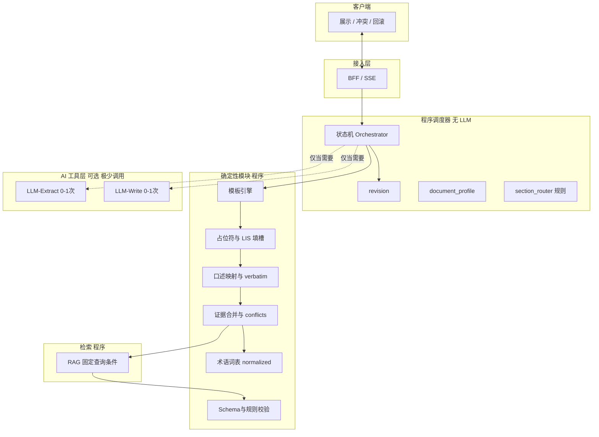
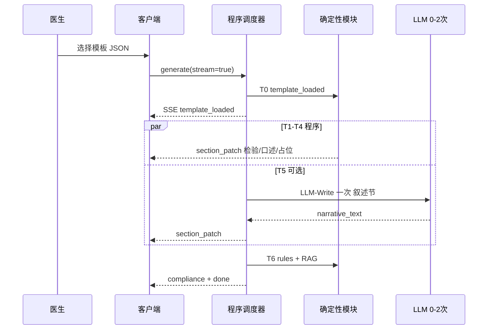
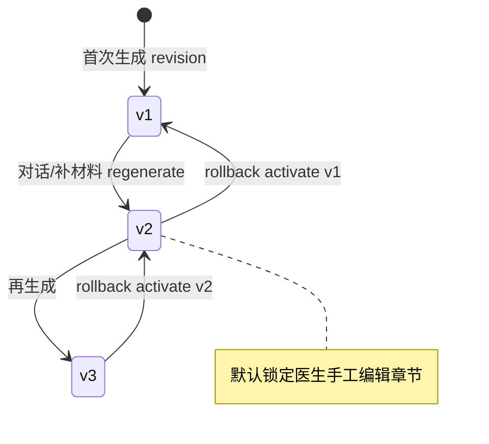
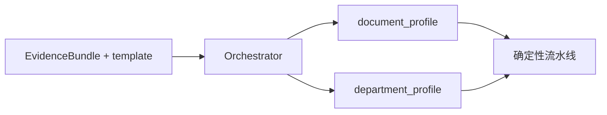
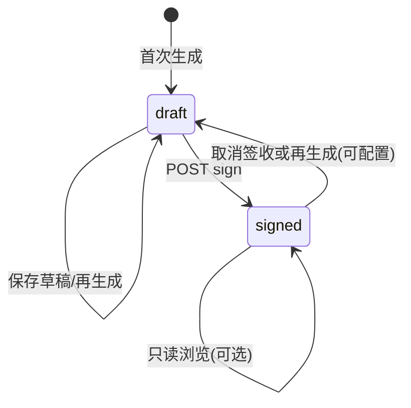
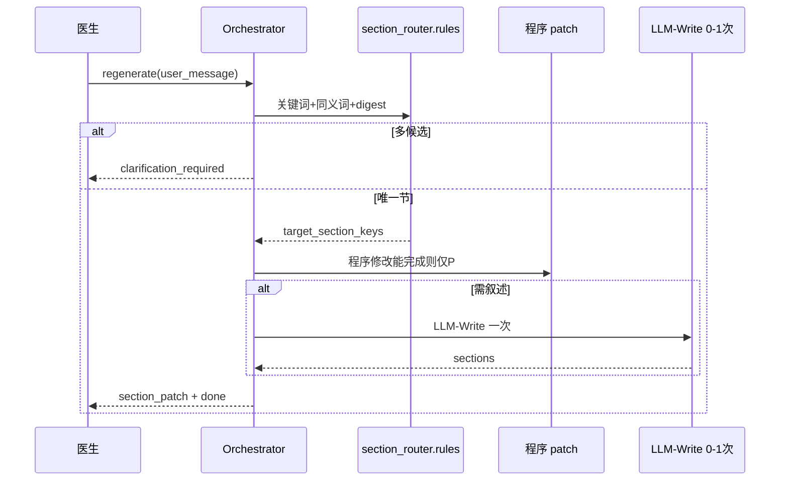

# 智能病历辅助生成系统 — 产品文档

**文档版本**：v0.4（架构方案 B）  
**路线**：C（事实层 + 文书模板 + 合规硬约束；鉴别/治疗建议为可选模块且默认弱化）  
**架构**：**程序调度器 + 极少 LLM**（见 [4.1](#41-方案-b程序调度--ai-调用预算)）  
**适用司法区**：中国大陆（具体以各医疗机构合规要求为准）  
**状态**：首期试点规格（儿科、胸外科；**住院病历为首期必交付**，门诊可并行或紧随其后）

---

## 目录

1. [文档目的与定位](#1-文档目的与定位)  
2. [用户与干系人](#2-用户与干系人)  
3. [首期范围与交付形态](#3-首期范围与交付形态)  
4. [整体架构](#4-整体架构)  
4.1. [方案 B：程序调度 + AI 调用预算](#41-方案-b程序调度--ai-调用预算)  
5. [端到端业务流程](#5-端到端业务流程)  
6. [文书路由与科室配置](#6-文书路由与科室配置)  
7. [技术框架](#7-技术框架)  
8. [数据契约](#8-数据契约)  
9. [各阶段提示词模板](#9-各阶段提示词模板)  
10. [MCP 工具划分](#10-mcp-工具划分)  
11. [非功能需求](#11-非功能需求)  
12. [风险与免责声明](#12-风险与免责声明)  
13. [研发顺序建议](#13-研发顺序建议)  
14. [病种/场景模板优先](#14-病种场景模板优先)  
15. [先显模板 + 流式增量更新](#15-先显模板--流式增量更新)  
16. [医生口述优先保留](#16-医生口述优先保留)  
17. [模板治理与版本回滚](#17-模板治理与版本回滚)  
18. [流式 ASR 与会话节拍](#18-流式-asr-与会话节拍)  
19. [结构化与口述冲突处理](#19-结构化与口述冲突处理)  
20. [节级 LLM 超时与重试](#20-节级-llm-超时与重试)  
21. [再生成与章节锁定](#21-再生成与章节锁定)  
22. [首期验收清单](#22-首期验收清单)  
23. [附录：API 与事件摘要](#23-附录api-与事件摘要)  
24. [证据与冲突优先级](#24-证据与冲突优先级)  
25. [病历生命周期与签收](#25-病历生命周期与签收)  
26. [再生成：自然语言自动找节](#26-再生成自然语言自动找节)  
27. [附录 B：住院入院记录 Schema](#27-附录-b住院入院记录-schema)  
28. [附录 C：错误码与 SSE payload 示例](#28-附录-c错误码与-sse-payload-示例)  
29. [安全与合规专章（默认策略）](#29-安全与合规专章默认策略)  
30. [附录 D：首期金样例](#30-附录-d首期金样例)

---

## 1. 文档目的与定位

### 1.1 目的

在**执业医师终审**前提下，将 ASR 转写、检验检查（PDF/结构化）、既有病历 JSON、LIS/PACS 等，统一整理为**可追溯的结构化事实**，在**医师选定的病种/场景模板**基础上填充与修订，输出**病历草稿 JSON**，经**规则 + 院规 RAG** 合规校验后供客户端展示；支持**版本回滚**与**再生成**。

### 1.2 非目的

- 不构成独立诊疗行为，不替代医师对诊断与医嘱的确认。  
- 首期**不默认**输出确定性鉴别诊断与治疗方案正文（见 [9.8](#98-可选模块鉴别--治疗建议默认关闭)）。  
- **不**在本系统内维护模板配置页面（由集成方页面配置并以 JSON 传入）。

### 1.3 产品原则

| 原则 | 说明 |
|------|------|
| 事实不虚构 | 无来源不写；不确定标待核实 |
| 模板为底稿 | 填充/补丁，非从零重写 |
| 口述少改 | 医生轨 verbatim 优先 |
| 冲突不替医生选 | 结构化与口述双显，高亮，医师选择 |
| 可演进 | 模块化、版本化、金样例回归 |
| **程序优先** | 编排与合规则代码实现；LLM 仅为被调用工具 |
| **AI 预算** | 单次生成 ≤2 次 LLM；再生成 ≤1 次（硬约束） |

---

## 2. 用户与干系人

| 角色 | 诉求 |
|------|------|
| 临床医生 | 少打字、模板快显、流式更新、冲突可选、可回滚 |
| 病案/质控 | 必填项、术语规范、草稿可存、签收前可警告 |
| 信息科 | JSON 契约、云/私有化可切换、审计 |
| 产品/集成方 | 模板 JSON 下发、客户端展示与版本管理 |

---

## 3. 首期范围与交付形态

### 3.1 文书类型（单调度器 + 文书配置）

**仅一个程序调度器（Orchestrator）**；不同文书通过 `document_type` + `document_profile` 配置区分，**不**为每种文书部署独立 LLM Agent。

| `document_type` | 首期 | 配置包 |
|-----------------|------|--------|
| `inpatient_admission`（入院记录） | **必交付** | 见 [附录 B](#27-附录-b住院入院记录-schema) |
| `progress_note`（病程记录） | 建议至少 1 种模板 | `profiles/progress_note.yaml` |
| `outpatient` | 可并行 | 章节为入院记录子集 |
| `discharge` / `front_sheet` | 二期 | — |

**科室**：`department_profile`（词表、检索 filter、增量规则）；儿科、胸外首期试点；未命中 → `general` + `warning`。

### 3.2 输入

- 流式 ASR 最终结果（见 [18](#18-流式-asr-与会话节拍)）  
- 医师选定的**模板 JSON**（由集成方配置页生成）  
- PDF/OCR、既有病历 JSON  
- LIS/PACS 结构化数据  

### 3.3 输出

- 病历草稿 **JSON**（客户端渲染）  
- `facts`、`draft_note`、`compliance`、`provenance`、`conflicts`（若有）  
- `revision` 版本链，支持回滚与再生成  

### 3.4 首期不包含（默认关闭）

- 鉴别诊断 / 治疗建议正文模块（[9.8](#98-可选模块鉴别--治疗建议默认关闭)）  
- 自建模板 CMS（模板由调用方传入）

---

## 4. 整体架构



**设计要点**：

- **调度 = 代码状态机**，不用 LLM 决定流程。  
- **LLM 仅两类工具**：`LLM-Extract`（叙述抽取）、`LLM-Write`（叙述成段）；经统一 `LLMClient`（OpenAI-compatible）。  
- 模板由调用方传入；本服务只消费与版本记录。

---

## 4.1 方案 B：程序调度 + AI 调用预算

### 4.1.1 原则

| 能做程序 | 不做 AI |
|----------|---------|
| 模板加载、占位符替换 | — |
| LIS/PACS/影像结构化写入 | — |
| 口述 verbatim 映射到 `section_key` | — |
| 证据合并、`conflicts[]` | — |
| 术语映射（院内词表） | LLM 规范化 |
| RAG 查询（科室+文书+字段 key） | LLM 生成 query |
| 再生成找节（关键词/同义词表） | LLM 路由 |
| Schema / 病案规则校验 | LLM 合规正文 |

### 4.1.2 AI 调用预算（硬约束）

| 场景 | LLM 次数上限 | 允许调用的工具 |
|------|----------------|----------------|
| **首次生成** | **≤2** | `LLM-Extract` 0～1 + `LLM-Write` 0～1 |
| **再生成** | **≤1** | 仅 `LLM-Write`（找节必须程序完成） |
| **回滚 activate** | **0** | — |
| **冲突 resolve** | **0** | — |
| **签收 sign** | **0** | — |

写入 `provenance.ai_calls[]`：每次调用的 `tool`、`prompt_hash`、`latency_ms`。

### 4.1.3 何时调用 LLM（默认策略）

| 工具 | 调用条件（满足才调，否则跳过） |
|------|--------------------------------|
| `LLM-Extract` | ASR 存在**大段叙述**且规则无法切分进 `facts`；或 `document_profile.require_narrative_extract=true` |
| `LLM-Write` | 存在 `narrative_sections[]` 需成段（如现病史）；且规则填槽后仍 `gaps` 含「需叙述连接」 |

**默认首期住院**：`LLM-Extract=0`（口述走 DICT）；`LLM-Write=0～1`（仅 `present_illness` 等配置节）；其余节 **100% 程序**。

### 4.1.4 确定性流水线（默认路径）

```text
T0  template_engine.load          → SSE template_loaded
T1  fill_structured.labs_imaging  → SSE section_patch（无 LLM）
T2  dictation.map_verbatim        → SSE physician_verbatim_patch（无 LLM）
T3  merge.detect_conflicts        → 更新 conflicts（无 LLM）
T4  template.fill_placeholders    → SSE section_patch（无 LLM）
T5  [可选] LLM-Write 一次         → SSE section_patch（叙述节）
T6  rules.validate + RAG          → SSE compliance → done
```

---

## 5. 端到端业务流程

### 5.1 首次生成（方案 B：程序为主 + 至多 2 次 LLM）



### 5.2 再生成与回滚



---

## 6. 文书路由与科室配置



| 配置 | 内容 |
|------|------|
| `document_profile` | `section_keys`、哪些节走 `LLM-Write`、`require_narrative_extract` |
| `department_profile` | 术语词表、RAG filter、增量质控规则 |

**不**按文书类型部署多个 LLM Agent；仅加载不同 YAML/JSON 配置。

---

## 7. 技术框架

| 层级 | 推荐 | 说明 |
|------|------|------|
| API/BFF | FastAPI / Spring Boot | REST + **SSE/WebSocket** |
| 编排 | 自研状态机 / LangGraph / Temporal | 版本、重试、节级并发 |
| LLM | OpenAI-compatible 抽象 | 云 API ↔ vLLM/TGI |
| 嵌入 | 独立 Embedding 服务 | 与 chat 解耦 |
| RAG | pgvector / Milvus + 可选 ES | 院规、书写规范；首期可小库 |
| 存储 | PostgreSQL + MinIO | revision、审计、附件 |
| 队列 | Kafka/RabbitMQ 可选 | 大 PDF 异步 |
| 观测 | OpenTelemetry + Prometheus | 节级延迟、重试率 |

**私有化**：仅替换推理/嵌入 endpoint；编排与契约不变。

---

## 8. 数据契约

### 8.1 请求（生成）

```json
{
  "session_id": "uuid",
  "note_id": "uuid",
  "base_revision_id": null,
  "document_type": "outpatient",
  "department_id": "pediatrics",
  "template": {
    "template_id": "thoracic_trauma_mva",
    "template_version": "3",
    "sections": []
  },
  "evidence": {
    "asr_final_text": "...",
    "asr_metadata": { "speaker": "physician_only", "mode": "dictation" },
    "pdf_spans": [],
    "emr_json": {},
    "labs_struct": [],
    "imaging_struct": []
  },
  "options": {
    "stream": true,
    "optional_modules": { "differential": false, "treatment": false },
    "regenerate": {
      "locked_sections": ["physical_exam"],
      "allow_ai_override_locked": false
    }
  }
}
```

### 8.2 响应顶层

```json
{
  "schema_version": "0.1.0",
  "note_id": "uuid",
  "revision_id": "uuid",
  "parent_revision_id": null,
  "document_type": "outpatient",
  "department_id": "pediatrics",
  "template_id": "thoracic_trauma_mva",
  "template_version": "3",
  "facts": {},
  "draft_note": {},
  "conflicts": [],
  "compliance": {
    "errors": [],
    "warnings": [{ "code": "CONFLICT_UNRESOLVED", "field": "..." }]
  },
  "provenance": {
    "architecture": "B",
    "ai_call_budget": { "max": 2, "used": 0 },
    "ai_calls": [],
    "model_id": "",
    "prompt_hash": "",
    "corpus_version": "",
    "rulepack_version": ""
  },
  "optional_modules": {}
}
```

### 8.3 证据合并优先级

**接口结构化（LIS/PACS）> 已确认病历 JSON > 报告 PDF/OCR > ASR 口述**

冲突时**不静默覆盖**，进入 [19](#19-结构化与口述冲突处理)。

### 8.4 字段级元数据（建议）

```json
{
  "draft_note": {
    "present_illness": {
      "text": "...",
      "confidence": 0.92,
      "source_type": "llm_patch|physician_verbatim|template_default|fact",
      "section_status": "ok|degraded|failed",
      "locked": false
    }
  }
}
```

### 8.5 病历状态字段

```json
{
  "note_status": "draft|signed",
  "active_revision_id": "uuid",
  "signed_at": null,
  "signed_by": null
}
```

- `draft`：可编辑、可再生成、可保存；冲突未解决仅 warning。  
- `signed`：表示医师完成本轮确认签收；见 [25](#25-病历生命周期与签收)。

### 8.6 `template.sections` 与 `draft_note` 映射

| `template.sections[].key` | `draft_note` 字段 | 说明 |
|---------------------------|-------------------|------|
| 与附录 B `section_key` 一致 | 同名字段对象 | patch 仅允许写入已定义 key |
| 未知 key | 忽略并 `warning` | 防止模板与 Schema 漂移 |

---

## 9. LLM 提示词与程序模块

### 9.0 模块分类（方案 B）

| 模块 | 实现 | 计入 AI 预算 |
|------|------|----------------|
| `template_engine` | 程序 | 否 |
| `fill_structured` | 程序 | 否 |
| `dictation.map` | 程序 | 否 |
| `merge.conflicts` | 程序 | 否 |
| `terminology.dict` | 程序词表 | 否 |
| `section_router.rules` | 程序关键词 | 否 |
| `rag.search` | 程序固定 query | 否 |
| `rules.validate` | 程序 | 否 |
| **`LLM-Extract`** | 见 9.1 | 是（0～1） |
| **`LLM-Write`** | 见 9.2 | 是（0～1） |
| ~~9.3 术语 LLM~~ | 废弃，用词表 | — |
| ~~9.4 合并 LLM~~ | 废弃，用程序 | — |
| ~~9.5 RAG query LLM~~ | 废弃 | — |
| ~~9.6 分节 patch LLM~~ | 合并入 9.2 单次 Write | — |
| ~~9.9 LLM 找节~~ | 废弃，见 [26](#26-再生成自然语言自动找节) | — |

**全局参数**（仅 LLM 调用时）：`temperature=0`；`prompt_version` 写入 `provenance.ai_calls[]`；输出 **JSON**。

### 9.1 LLM-Extract（可选，0～1 次）

```text
你是医院病历文书辅助系统的“事实抽取模块”。工作司法区：中国大陆。输出用于医师审核，不构成诊疗结论。

硬规则：
1) 只输出输入中可支持的事实；不得推测、不得补全未提及内容。
2) 不确定写入 unknown 或 needs_clarification，并附 evidence_quote。
3) 禁止输出最终诊断、鉴别诊断、治疗方案正文。
4) 若 speaker=physician_only 或医生口述模式：
   - 输出 physician_dictation_segments[]，verbatim 与输入一致，不改写。
   - 不得改为“患者诉…”语气。
   - 无法归类写入 unmapped_in_extraction[]，不得省略。
5) 仅输出一个合法 JSON，不要 Markdown。

输入：
- 科室：{{department_id}}
- 文书类型：{{document_type}}
- ASR 文本：{{asr_final_text}}

输出 Schema：narrative_facts[]、physician_dictation_segments[]（与程序 DICT 结果合并，不覆盖 verbatim）。
```

**检验/检查 PDF**：由程序 `pdf_parser` + 规则抽取，**不调 LLM**（原 9.2 废弃）。

**术语 normalized**：由 `terminology.dict`（院内词表）生成，**不调 LLM**。

**证据合并 / conflicts**：由 `merge.conflicts` 程序实现，优先级见 [24](#24-证据与冲突优先级)。

**RAG**：`queries = f(department_id, document_type, section_keys_with_gaps)`，**不调 LLM**。

### 9.2 LLM-Write（可选，0～1 次，叙述成段）

```text
你是“病历叙述成段模块”（LLM-Write）。仅负责将已核实事实与口述整理为指定章节的医学书面语段落。

硬规则：
1) 一次调用可输出多节，但须在允许的 section_keys 列表内：{{allowed_narrative_sections}}。
2) physician_dictation 中已 verbatim 写入的句子不得改写；仅对 gaps 做连接与排序。
3) 禁止编造检验数值、诊断、治疗；禁止输出未在 facts_merged 中的内容。
4) 仅输出 JSON：
{
  "sections": [
    {"section_key":"present_illness","text":"...","source_refs":[...]}
  ],
  "gaps": [],
  "unmapped_physician_text": []
}
5) temperature=0；不要 Markdown。

输入：facts_merged、physician_dictation、template 片段、rag_snippets（如有）
```

### 9.7 合规说明（程序）

规则引擎产出 errors/warnings；**默认不调 LLM** 生成说明。客户端用 `warning.code` 映射固定文案表。

### 9.8 可选模块：鉴别 / 治疗建议（默认关闭）

```text
试点模块。每条须引用 facts 或指南 citation_id；假设性措辞；不得自拟给药方案。
仅输出 differential_hypotheses、workup_suggestions、treatment_notes_from_physician_only。
```

### 9.9（已废弃）

再生成找节改为 **程序 `section_router.rules`**，见 [26](#26-再生成自然语言自动找节)。**禁止**使用 LLM 路由（不计入预算且不稳定）。

---

## 10. MCP 工具划分

| 工具 | 实现 | 职责 |
|------|------|------|
| `template.fill` | 程序 | 占位符与模板引擎 |
| `dictation.map` | 程序 | 口述 verbatim 映射 |
| `facts.merge` | 程序 | 合并与 conflicts |
| `terminology.map` | 程序 | 词表 normalized |
| `section.route` | 程序 | 关键词找节 |
| `rag.search_policy` | 程序 | 固定条件检索 |
| `validate.schema` / `validate.rules` | 程序 | 校验 |
| `revision.*` | 程序 | 版本与回滚 |
| `llm.extract` | AI ≤1 | 可选叙述抽取 |
| `llm.write` | AI ≤1 | 可选叙述成段 |

模板由调用方 JSON 传入。

---

## 11. 非功能需求

| 类别 | 要求 |
|------|------|
| 稳定性 | temperature=0；prompt/语料/规则/template 版本入 provenance；金样例 CI |
| 性能 | T0–T4 零 LLM；整单 ≤2 次 LLM；首屏 <200ms（模板） |
| AI 预算 | 超限拒绝并 `error.code=AI_BUDGET_EXCEEDED` |
| 可用性 | 节级重试与降级；回滚不调 LLM |
| 安全 | 脱敏、审计、权限；私有化全链路内网 |
| 草稿 | **冲突未解决允许保存草稿**（warning，不阻断） |
| 签收 | **未解决冲突默认强提示，不阻断签收**（见 [25](#25-病历生命周期与签收)） |

---

## 12. 风险与免责声明

系统输出为**草稿**，须经执业医师审核、修改、确认后方为有效病历。模型错误、数据缺失、冲突未解决等以**医师选择与院内制度**为准。客户端须展示 AI 辅助与版本来源说明。

---

## 13. 研发顺序建议

1. 实现 **程序 Orchestrator** + T0–T6 流水线（[4.1.4](#414-确定性流水线默认路径)）  
2. 冻结住院 Schema + `ai_calls` / `AI_BUDGET_EXCEEDED`  
3. `template_engine`、`fill_structured`、`dictation.map`、`merge.conflicts`  
4. `section_router.rules` + 再生成 ≤1 次 `LLM-Write`  
5. SSE + `conflicts` + draft/sign  
6. 儿科/胸外金样例；断言 `provenance.ai_calls.length ≤ 预算`  
7. 可选启用 `LLM-Write`；门诊/病程扩展  

---

## 14. 病种/场景模板优先

### 14.1 行为

医师选定模板（如胸外「车祸」）后：

1. 服务端用传入的 `template.sections` **立即**生成 `draft_note` 骨架。  
2. 事实流水线完成后，按节 **fill / patch**，非全文重写。  
3. 输出保留 `template_id`、`template_version` 与 `patch_log`。

### 14.2 填充策略

| 情况 | 策略 |
|------|------|
| 事实匹配占位符 | 替换占位，保留模板句式 |
| 事实与模板冲突 | 按 [24](#24-证据与冲突优先级) 优先级表，不自行覆盖已 resolve/手工编辑 |
| 事实有、模板无 | append |
| 模板有、事实无 | 保留默认句 + `gaps` |

### 14.3 规则优先（方案 B）

时间、检验、占位符、口述映射 **全部程序**；仅 `document_profile.narrative_sections` 可触发 **至多 1 次** `LLM-Write`。

---

## 15. 先显模板 + 流式增量更新

### 15.1 阶段

| 阶段 | 用户所见 | LLM |
|------|----------|-----|
| T0 | 完整模板（占位可灰色） | 无 |
| T1 | 检验等规则填槽字段更新 | 无 |
| T2 | 口述 verbatim 写入对应节 | 可选无 |
| T3 | 程序 patch 陆续到达 | 无 LLM |
| T4 | [可选] 一次 LLM-Write | ≤1 次 LLM |
| T5 | compliance + revision | 程序 |

### 15.2 SSE 事件类型

- `template_loaded`  
- `section_patch` / `section_append`  
- `physician_verbatim_patch`  
- `section_failed` / `section_rollback`  
- `compliance`  
- `revision_created`  
- `done`  

每事件带 `seq`；客户端按 `section_key` 合并。

---

## 16. 医生口述优先保留

| 原则 | 说明 |
|------|------|
| 不丢弃 | 口述必有落点或 `unmapped_physician_text` |
| 尽量不改动 | 主字段用 verbatim；normalized 为并行可选 |
| 不改患者语气 | 不擅自改成「患者诉…」 |
| 模板不盖口述 | 冲突以口述为准（`patch_log.reason=physician_dictation`） |

---

## 17. 模板治理与版本回滚

### 17.1 模板来源

- **集成方**通过配置页维护模板，请求时传入完整 JSON。  
- 本服务记录 `template_id`、`template_version` 至 `provenance`，**不**提供模板编辑 UI。

### 17.2 Revision 模型

| 字段 | 说明 |
|------|------|
| `note_id` | 病历逻辑 ID |
| `revision_id` | 每次生成/再生成 |
| `parent_revision_id` | 父版本 |
| `trigger` | `initial` \| `chat_refine` \| `add_material` \| `rollback` |

### 17.3 回滚

- `POST /v1/notes/{note_id}/revisions/{revision_id}/activate`  
- **不调 LLM**；客户端切换 `active_revision_id` 展示历史全文。  

### 17.4 再生成

- 携带 `base_revision_id`、新增 evidence 或 `user_message`。  
- 产生新 `revision_id`，`parent_revision_id=base`。  
- 体验：先显 base 全文 → 再对未锁定节流式 patch。

---

## 18. 流式 ASR 与会话节拍

### 18.1 说明

ASR 为**流式录音**，文本连续到达，**非**离线分段批处理。

### 18.2 集成约定

| 项 | 约定 |
|----|------|
| 传输 | WebSocket 或 SSE：`asr_partial` / `asr_final` |
| UI | `asr_partial` 仅实时转写区展示 |
| 触发抽取 | **`asr_final`（句末）或「结束录音」** 触发事实/口述归档 |
| 模式 | `speaker=physician_only` 或客户端「医生口述模式」 |

避免对每个 partial 调用 LLM，以控制成本与抖动。

---

## 19. 结构化与口述冲突处理

### 19.1 展示原则

- **两路均展示**，客户端**高亮**。  
- **系统不替医生选择**；未解决前 `resolution=pending`。  
- **允许保存草稿**；`compliance.warnings` 含 `CONFLICT_UNRESOLVED`，**不**作为 error 阻断草稿保存。  
- **签收（signed）**：未解决冲突 **默认强提示、不阻断**（`severity=strong` 的 warning，见 [25](#25-病历生命周期与签收)）。

### 19.2 conflicts 结构

```json
{
  "conflicts": [
    {
      "conflict_id": "c1",
      "field": "auxiliary_exam.wbc",
      "structured": {
        "display": "白细胞 12.5×10^9/L",
        "value": "12.5",
        "unit": "10^9/L",
        "source_ref": "lis:order_123"
      },
      "dictation": {
        "display": "白细胞一万二",
        "verbatim": "白细胞一万二",
        "source_ref": "asr:final_7"
      },
      "resolution": "pending",
      "resolved_value": null,
      "resolved_by": null,
      "resolved_at": null
    }
  ]
}
```

### 19.3 医生选择 API

`POST /v1/notes/{note_id}/conflicts/{conflict_id}/resolve`

```json
{
  "resolution": "chosen_structured|chosen_dictation|custom",
  "custom_value": "可选"
}
```

写入 `draft_note` 对应字段，更新 `revision` 或原地 patch（由院方审计要求决定）。

---

## 20. 节级 LLM 超时与重试

### 20.1 三层机制

| 层级 | 行为 |
|------|------|
| **L1 自动重试** | 同 prompt、同输入，最多 **3 次**，退避 1s/2s/4s |
| **L2 降级** | 保持模板默认 + 规则填槽 + 口述 verbatim；`section_status=degraded` |
| **L3 人工重试** | `POST .../sections/{section_key}/retry`，`idempotency_key=revision_id+section_key+attempt` |

### 20.2 流式事件

- 失败：`section_failed`  
- 重试成功：`section_patch`  
- 回退该节上次成功内容：`section_rollback`  

### 20.3 超时建议（可配置）

- 单节：15～30s  
- 整单：120s  

---

## 21. 再生成与章节锁定

### 21.1 默认策略

**再生成时，默认锁定医生已手工编辑过的章节**（`locked: true`）。

- 请求可带 `locked_sections[]`（客户端根据编辑历史自动填充）。  
- 默认 `allow_ai_override_locked=false`；医师显式勾选后才允许 AI 改该节。

### 21.2 自然语言自动找节（程序，首期）

医师**无需**传 `target_section_keys`；**禁止 LLM 路由**。

1. `section_router.rules`：关键词表 + 同义词（现病史/病程/查体…）+ `draft_note_digest` 命中。  
2. 唯一候选 → `target_section_keys`；多候选 → `clarification_required`。  
3. 对目标节：**程序 patch** 能完成则不调 LLM；否则 **≤1 次 `LLM-Write`**（仅涉及节）。  
4. 新 `revision_id`；`provenance.ai_calls` 累计 ≤1。

详见 [26](#26-再生成自然语言自动找节)。

### 21.3 再生成请求示例

```json
{
  "base_revision_id": "rev_002",
  "trigger": "chat_refine",
  "user_message": "把现病史里受伤时间改成昨日下午三点",
  "evidence_delta": {},
  "options": {
    "locked_sections": ["physical_exam"],
    "allow_ai_override_locked": false
  }
}
```

### 21.4 与冲突、草稿、签收的关系

- 再生成**不自动解决** pending 冲突，除非医师随后调用 `resolve` 或在对话中明确选择（客户端承接）。  
- `note_status=draft` 时可任意再生成；`signed` 后再改需先 **取消签收** 或 **新建修订**（由院方流程配置，默认：signed 后再生成自动置回 draft 并记审计）。  
- 草稿可在任意 revision 上保存。

---

## 22. 首期验收清单

| # | 项 | 标准 |
|---|-----|------|
| 1 | 模板先显 | 传入 template 后 200ms 内 `template_loaded` |
| 2 | 流式 patch | T1–T4 程序节可先后到达 |
| 2b | AI 预算 | 首次生成 `ai_calls.length ≤ 2`；再生成 ≤1 |
| 3 | 口述不丢 | 医生轨金样例 verbatim 覆盖率 100% |
| 4 | 冲突双显 | 冲突样例 UI 两路高亮 |
| 5 | 草稿 | 冲突未解决可保存，仅有 warning |
| 6 | 回滚 | activate 历史 revision 不调 LLM |
| 7 | 锁定 | 再生成默认不改 locked 节 |
| 8 | LLM 降级 | Write 失败后程序结果保留 + 可 retry_llm_write |
| 9 | 无虚构 | 金样例关键字段均有 source_refs |
| 10 | 版本 | provenance 含 template/prompt/rule 版本 |
| 11 | 住院 Schema | 附录 B 字段齐全且可渲染 |
| 12 | 规则找节 | 再生成 50 条指令，程序路由准确率≥90% |
| 16 | 架构 B | 金样例断言无 LLM 路由、预算不超限 |
| 13 | 签收强提示 | signed + 未解决冲突：强提示、不阻断 |
| 14 | 安全 | 满足 [29](#29-安全与合规专章默认策略) 默认审计字段 |
| 15 | 金样例 | 附录 D 四类用例回归通过 |

---

## 23. 附录：API 与事件摘要

### 23.1 主要 HTTP

| 方法 | 路径 | 说明 |
|------|------|------|
| POST | `/v1/notes/generate` | 首次生成，支持 `stream=true` |
| POST | `/v1/notes/{note_id}/regenerate` | 再生成 |
| POST | `/v1/notes/{note_id}/revisions/{id}/activate` | 回滚激活 |
| POST | `/v1/notes/{note_id}/conflicts/{id}/resolve` | 冲突选择 |
| POST | `/v1/notes/{note_id}/sections/{key}/retry` | 单节重试 |
| PUT | `/v1/notes/{note_id}/draft` | 保存草稿（含未解决冲突） |
| POST | `/v1/notes/{note_id}/sign` | 签收，`note_status=signed` |

### 23.2 SSE 事件（data 为 JSON）

| event | 说明 |
|-------|------|
| `template_loaded` | 首屏模板全文 |
| `section_patch` | 节内容更新 |
| `physician_verbatim_patch` | 口述原文字段 |
| `section_failed` | 节失败 |
| `section_rollback` | 节回退 |
| `compliance` | 校验结果 |
| `revision_created` | 新版本 ID |
| `done` | 流水线结束 |
| `clarification_required` | 再生成无法确定章节，见 9.9 |

---

## 24. 证据与冲突优先级

当多来源同时作用于同一字段时，按下列顺序决定**自动写入**行为（医生显式操作始终最高）：

| 优先级 | 来源 | 行为 |
|--------|------|------|
| 1 | 医师 `resolve` 冲突后的 `resolved_value` | 写入主字段，不再自动覆盖 |
| 2 | 医师手工编辑（`locked=true` 或编辑历史） | 再生成默认跳过 |
| 3 | 医师口述 verbatim（医生轨） | 写入主字段；与 LIS 冲突 → `conflicts` 双显 |
| 4 | LIS/PACS 结构化 | 写入或进入 `conflicts`（与口述冲突时） |
| 5 | 已确认 EMR JSON | 同上 |
| 6 | PDF/OCR 报告文本 | 抽取后写入 |
| 7 | 模板默认句 | 仅当上位无内容时保留；有 `gaps` 标记 |

**结构化 vs 口述**：不自动二选一，进入 [19](#19-结构化与口述冲突处理)，由医师 `resolve`。

---

## 25. 病历生命周期与签收



### 25.1 `draft`

- 允许：编辑、`regenerate`、保存、`resolve` 冲突。  
- `CONFLICT_UNRESOLVED`：**warning**，不阻断保存。

### 25.2 `signed`（默认策略）

- 表示医师确认当前 `active_revision_id` 内容。  
- **未解决冲突**：**强提示、不阻断签收**。  
  - `compliance.warnings[]` 示例：

```json
{
  "code": "CONFLICT_UNRESOLVED",
  "severity": "strong",
  "field": "auxiliary_exam.wbc",
  "message": "白细胞结果存在口述与检验不一致，已签收但未解决冲突，请核对。",
  "blocks_sign": false
}
```

- 客户端：**显著 UI**（如顶部横幅、字段红框），非模态阻断。  
- 院方可通过配置 `compliance.policy.blocks_sign_on_conflict=true` 改为阻断（**非首期默认**）。

### 25.3 签收 API

`POST /v1/notes/{note_id}/sign`

```json
{
  "revision_id": "rev_003",
  "signed_by": "physician_id"
}
```

响应含最新 `compliance`（含 strong warnings）。

---

## 26. 再生成：自然语言自动找节（程序路由）

### 26.1 流程



### 26.2 `section_router.rules`（配置示例）

```yaml
synonyms:
  现病史: present_illness
  病史: present_illness
  查体: physical_exam
  体格检查: physical_exam
  辅助检查: auxiliary_exam
  诊断: preliminary_diagnosis
content_hints:
  白细胞: auxiliary_exam
  体温: present_illness
  骨折: [present_illness, specialist_exam]
```

| 场景 | 处理 |
|------|------|
| 明确章节名 | 直接映射 `section_key` |
| 仅内容线索 | `content_hints` + digest 打分，取最高 |
| 多节同分 | `clarification_required` |
| locked | 跳过 + `warning` |
| 补材料 | `add_material` → 程序 merge 后 patch |

### 26.3 评测

**≥50 条**口语指令；程序路由准确率 **≥90%**（相对人工标注）。**禁止**用 LLM 参评路由本身。

---

## 27. 附录 B：住院入院记录 Schema

`document_type = inpatient_admission`。`draft_note` 各节为对象，结构统一：

```json
{
  "text": "章节正文",
  "verbatim": "可选，口述原文",
  "normalized": "可选，术语规范化",
  "source_refs": ["lis:1", "asr:final_3"],
  "source_type": "template_default|fact|physician_verbatim|llm_patch",
  "section_status": "ok|degraded|failed",
  "locked": false
}
```

### 27.1 `section_key` 枚举（首期必支持）

| section_key | 中文名 | 必填（首期） |
|-------------|--------|--------------|
| `chief_complaint` | 主诉 | 是 |
| `present_illness` | 现病史 | 是 |
| `past_history` | 既往史 | 是 |
| `personal_history` | 个人史 | 视模板 |
| `marital_reproductive_history` | 婚育史 | 视模板/儿科可隐藏 |
| `family_history` | 家族史 | 视模板 |
| `physical_exam` | 体格检查 | 是 |
| `specialist_exam` | 专科情况 | 胸外等专科模板 |
| `auxiliary_exam` | 辅助检查 | 是 |
| `preliminary_diagnosis` | 初步诊断 | 仅医师口述/手工，AI 不推断 |
| `treatment_plan` | 诊疗计划 | 仅医师口述/手工精炼 |

### 27.2 完整 `draft_note` 示例（节选）

```json
{
  "chief_complaint": {
    "text": "车祸伤后胸痛2小时。",
    "source_refs": ["asr:final_1"],
    "source_type": "physician_verbatim",
    "section_status": "ok",
    "locked": false
  },
  "present_illness": {
    "text": "患者于2小时前因交通事故受伤，伤后感胸痛...",
    "source_refs": ["asr:final_2", "template:thoracic_trauma_mva"],
    "source_type": "llm_patch",
    "section_status": "ok",
    "locked": false
  },
  "auxiliary_exam": {
    "text": null,
    "candidates": [],
    "display_mode": "conflict_pending",
    "section_status": "ok",
    "locked": false
  },
  "preliminary_diagnosis": {
    "text": "肋骨骨折？",
    "source_refs": ["asr:final_8"],
    "source_type": "physician_verbatim",
    "section_status": "ok",
    "locked": true
  }
}
```

### 27.3 `EvidenceBundle`（住院）

```json
{
  "session_id": "uuid",
  "document_type": "inpatient_admission",
  "department_id": "thoracic_surgery",
  "template": { "template_id": "...", "template_version": "...", "sections": [] },
  "evidence": {
    "asr_final_text": "...",
    "asr_metadata": { "speaker": "physician_only", "mode": "dictation" },
    "labs_struct": [],
    "imaging_struct": [],
    "pdf_spans": [],
    "emr_json": {}
  }
}
```

### 27.4 病程记录 `progress_note`（首期最小集）

| section_key | 中文名 |
|-------------|--------|
| `course_summary` | 病例特点/病程摘要 |
| `diagnosis_discussion` | 诊断讨论（不自动推断，仅整理口述） |
| `treatment_plan` | 诊疗计划 |

结构与 27.1 相同；模板由调用方传入。

---

## 28. 附录 C：错误码与 SSE payload 示例

### 28.1 HTTP 错误码（`error.code`）

| code | HTTP | 说明 |
|------|------|------|
| `SCHEMA_INVALID` | 400 | 请求体不符合 Schema |
| `TEMPLATE_MISMATCH` | 400 | template.sections.key 与 document_type 不匹配 |
| `NOTE_NOT_FOUND` | 404 | note_id 不存在 |
| `REVISION_NOT_FOUND` | 404 | revision_id 不存在 |
| `SECTION_LOCKED` | 409 | 再生成目标节已锁定 |
| `SECTION_TIMEOUT` | 504 | 节级 LLM 超时且降级 |
| `ROUTER_CLARIFICATION` | 422 | 程序路由无法唯一找节 |
| `AI_BUDGET_EXCEEDED` | 429 | 超过 LLM 调用预算 |
| `IDEMPOTENCY_CONFLICT` | 409 | 幂等键重复但请求体不同 |

### 28.2 SSE 示例

**section_patch**

```json
{
  "seq": 5,
  "revision_id": "rev_004",
  "section_key": "present_illness",
  "op": "replace",
  "text": "患者于昨日15:00因交通事故受伤...",
  "source_refs": ["asr:final_12"],
  "section_status": "ok"
}
```

**clarification_required**

```json
{
  "seq": 2,
  "revision_id": "rev_004",
  "needs_clarification": true,
  "clarification_question": "您要修改的是「现病史」还是「体格检查」中的描述？",
  "ambiguous_sections": [
    {"key": "present_illness", "reason": "提到受伤时间"},
    {"key": "physical_exam", "reason": "提到查体相关"}
  ]
}
```

**compliance（signed + 强提示）**

```json
{
  "seq": 20,
  "note_status": "signed",
  "warnings": [
    {
      "code": "CONFLICT_UNRESOLVED",
      "severity": "strong",
      "field": "auxiliary_exam.wbc",
      "blocks_sign": false
    }
  ],
  "errors": []
}
```

---

## 29. 安全与合规专章（默认策略）

> 本章为**首期默认假设**，院方可在部署时通过 `security_policy` 配置覆盖。上线前须由信息科、法务确认。

### 29.1 法规与标准对齐（目标）

| 依据 | 落地要求（默认） |
|------|------------------|
| 《个人信息保护法》 | 患者信息为敏感个人信息；最小必要、明示同意（由院方患者授权流程承接） |
| 《数据安全法》 | 医疗健康数据分类分级管理、境内存储 |
| 《网络安全法》 | 边界防护、访问控制、安全审计 |
| 等保 2.0（三级医院常见目标） | 按**等保二级**基线设计日志、鉴权、加密；等保测评由院方单独立项 |
| 卫健行业数据分类 | 患者诊疗数据默认 **核心/重要数据** 级防护 |

### 29.2 数据分级（默认）

| 级别 | 数据示例 | 存储与传输 |
|------|----------|------------|
| L1 公开 | 脱敏后的产品版本号、模板 ID（无患者关联） | 普通通道 |
| L2 内部 | 聚合统计、无标识的质控指标 | 内网 |
| L3 机密 | 病历全文、ASR、检验结果、影像报告 | 加密存储 + TLS + 严格 RBAC |
| L4 高敏（可选） | 传染病、精神心理等专科扩展 | 额外审批与字段级加密（二期） |

**默认**：所有 `EvidenceBundle`、`draft_note`、`revision` 均为 **L3**。

### 29.3 脱敏与日志（默认）

**写入应用日志、链路追踪、错误栈时，必须脱敏或哈希化：**

| 字段 | 日志中处理 |
|------|------------|
| 姓名 | 不记录或 `张*` |
| 身份证号、手机号 | 不记录或后四位 |
| 住址 | 不记录 |
| 住院号/门诊号 | 哈希 `patient_ref_hash` |
| 病历正文 | **不**写入 debug 日志；仅记 `note_id`、`revision_id`、字段路径 |

**LLM 调用日志（默认）**：

- 记录：`request_id`、`prompt_hash`、`model_id`、`token 用量`、`latency`、**不记录完整 prompt/response 正文**（或仅加密存档 L3 区，保留 **90 天**）。  
- 院方若要求调优：可开 `audit_store_encrypted=true`，存密文，密钥院方托管。

### 29.4 传输与存储加密（默认）

| 项 | 默认 |
|----|------|
| 传输 | HTTPS TLS 1.2+；内网服务间可选 mTLS |
| 静态存储 | AES-256；数据库 TDE 或卷加密（院方基础设施） |
| 对象存储 PDF | 服务端加密（SSE） |
| 向量库 | 仅存切片文本；**默认不上传可识别患者标识**；元数据用 `patient_ref_hash` |
| 备份 | 与生产同级加密；备份访问同 RBAC |

### 29.5 身份认证与 RBAC（默认）

**认证**：OIDC / 院方 SSO；API Bearer Token 或 mTLS（院内服务间）。

| 角色 | 权限（默认） |
|------|----------------|
| `physician` | 本人主管患者：生成、再生成、resolve 冲突、签收、回滚 |
| `resident` | 同组患者：生成与草稿；**签收**可配置需上级授权 |
| `department_admin` | 本科室模板与规则只读；无患者正文批量导出 |
| `medical_records_qc` | 质控只读 + 合规报告；不可改病历 |
| `system_admin` | 配置与运维；**默认不可**读 L3 病历正文（break-glass 需双因子+审计） |

**鉴权粒度**：`note_id` 绑定 `patient_ref` + `department_id` + `attending_physician_id`（由集成方传入 `patient_meta`）。

### 29.6 公有云 LLM 使用策略（默认）

| 策略 | 默认 |
|------|------|
| 出境 | 患者标识与病历正文 **不出境**；云厂商区域 **中国大陆** |
| 训练 | 合同约定 **禁止使用院方数据训练** 基础模型 |
| 留存 | 云侧 **零留存** 或 ≤24h 临时缓存（以合同为准） |
| 内容 | 发往模型的 payload **先脱标识**（`patient_ref_hash` 替代真实 ID）；必要时仅发 facts 摘要 |
| 私有化 | 一键切换 `LLM_ENDPOINT` 至院内 vLLM/TGI，契约不变 |

### 29.7 审计日志（默认必填字段）

每条与病历相关的操作写 **append-only 审计表**（保留 **3 年**，可配置）：

```json
{
  "audit_id": "uuid",
  "timestamp": "ISO8601",
  "actor_id": "physician_id",
  "actor_role": "physician",
  "action": "generate|regenerate|resolve_conflict|sign|rollback|draft_save|section_retry",
  "note_id": "uuid",
  "revision_id": "uuid",
  "patient_ref_hash": "sha256...",
  "department_id": "pediatrics",
  "document_type": "inpatient_admission",
  "template_id": "...",
  "template_version": "...",
  "model_id": "...",
  "prompt_hash": "...",
  "corpus_version": "...",
  "rulepack_version": "...",
  "client_ip": "10.x.x.x",
  "result": "success|failure",
  "error_code": null
}
```

**不记录**：完整 `user_message` 正文（可记 hash）；完整 ASR 文本（可记长度与 hash）。

### 29.8 流式 ASR 通道安全（默认）

| 项 | 默认 |
|----|------|
| 通道 | WSS + Token；Token 与 `session_id` 绑定，**15 分钟**过期 |
| 音频 | 音频流 **不经本服务落盘**（由 ASR 服务处理）；本服务仅收文本 |
| 文本 | `asr_partial` 仅内存；`asr_final` 入 L3 存储 |

### 29.9 事件响应与权限回收（默认）

| 事件 | 动作 |
|------|------|
| 账号离职 | 24h 内禁用 Token；历史审计保留 |
| 疑似泄露 | 支持按 `note_id` / `patient_ref_hash` 追溯访问链 |
| 密钥轮换 | API Key / 数据库密钥 **≤90 天** 轮换（可配置） |

### 29.10 配置项（院方可覆盖）

```json
{
  "security_policy": {
    "audit_retention_days": 1095,
    "llm_log_encrypted_days": 90,
    "blocks_sign_on_conflict": false,
    "cloud_llm_region": "cn",
    "allow_cloud_llm": true,
    "resident_can_sign": false,
    "break_glass_enabled": false
  }
}
```

---

## 30. 附录 D：首期金样例

> 用于 CI 回归与科内验收。每条包含：**输入摘要**、**期望断言**（不必逐字匹配，关键字段与规则须满足）。  
> 患者信息均为**虚构**。

---

### D-1 胸外科 · 车祸模板 · 标准生成

**场景**：`department_id=thoracic_surgery`，模板 `thoracic_trauma_mva_v3`，入院记录。

**输入摘要**

```json
{
  "document_type": "inpatient_admission",
  "department_id": "thoracic_surgery",
  "template": { "template_id": "thoracic_trauma_mva", "template_version": "3" },
  "evidence": {
    "asr_final_text": "查体：右侧呼吸音减弱，无皮下气肿。初步诊断考虑肋骨骨折。",
    "asr_metadata": { "speaker": "physician_only", "mode": "dictation" },
    "labs_struct": [
      { "code": "WBC", "name": "白细胞", "value": "12.5", "unit": "10^9/L", "flag": "high", "source_ref": "lis:ord_1001" }
    ],
    "imaging_struct": [
      { "modality": "CT", "body_part": "胸部", "findings": "右侧第5肋骨折", "impression": "右侧肋骨骨折", "source_ref": "pacs:stu_2001" }
    ]
  }
}
```

**期望断言**

| # | 断言 |
|---|------|
| 1 | T0 返回 `template_loaded`，含模板现病史骨架 |
| 2 | `chief_complaint` / `physical_exam` 含口述要点，`source_type=physician_verbatim` 或等价 |
| 3 | `auxiliary_exam` 含 WBC 12.5 与 CT 骨折描述，均有 `source_refs` |
| 4 | **无** AI 自拟诊断句；`preliminary_diagnosis.text` 仅来自口述「肋骨骨折」 |
| 5 | `compliance.errors` 为空；`provenance` 含 template/model/prompt 版本 |
| 6 | 不存在未引用的检验数值 |

---

### D-2 胸外科 · 结构化 vs 口述冲突

**输入摘要**：在 D-1 基础上，`asr_final_text` 增加「白细胞一万二」；LIS 仍为 12.5×10^9/L。

**期望断言**

| # | 断言 |
|---|------|
| 1 | `conflicts[]` 含 `field` 指向 WBC 相关路径，`resolution=pending` |
| 2 | `auxiliary_exam` 为双轨或 `display_mode=conflict_pending`，**不**静默选一侧 |
| 3 | 保存草稿：`CONFLICT_UNRESOLVED` 为 warning，非 error |
| 4 | `POST sign` 成功，`warnings` 含 `severity=strong`，`blocks_sign=false` |

---

### D-3 儿科 · 发热入院 · 模板填充

**场景**：`department_id=pediatrics`，模板 `ped_fever_admission_v2`。

**输入摘要**

```json
{
  "document_type": "inpatient_admission",
  "department_id": "pediatrics",
  "template": { "template_id": "ped_fever_admission", "template_version": "2" },
  "evidence": {
    "asr_final_text": "患儿发热两天，最高39度，无惊厥。既往体健。",
    "asr_metadata": { "speaker": "physician_only", "mode": "dictation" },
    "labs_struct": [
      { "code": "CRP", "name": "C反应蛋白", "value": "28", "unit": "mg/L", "flag": "high", "source_ref": "lis:ord_3001" }
    ],
    "emr_json": {}
  }
}
```

**期望断言**

| # | 断言 |
|---|------|
| 1 | `present_illness` 含发热 2 天、最高 39℃ 等，有 `source_refs` |
| 2 | `past_history` 体现「既往体健」，来自口述 |
| 3 | `auxiliary_exam` 含 CRP 28，不编造未检查项目 |
| 4 | `marital_reproductive_history` 为空或模板配置隐藏，不强行生成 |
| 5 | 无成人用语误用（如「患者」可接受；不得出现与年龄矛盾内容） |

---

### D-4 儿科 · 再生成自然语言找节

**基线**：D-3 已生成 `revision rev_ped_001`。

**请求**

```json
{
  "base_revision_id": "rev_ped_001",
  "trigger": "chat_refine",
  "user_message": "把现病史里最高体温改成40度",
  "options": { "locked_sections": [], "allow_ai_override_locked": false }
}
```

**期望断言**

| # | 断言 |
|---|------|
| 1 | `section_intent_router` → `target_section_keys=["present_illness"]`，`confidence>=0.7` |
| 2 | 仅 `present_illness` 发生 patch；其他节文本 hash 不变 |
| 3 | 修改后现病史含「40」/「40℃」，且 `source_refs` 含对话或修订来源 |
| 4 | 新 `revision_id`，`parent_revision_id=rev_ped_001` |
| 5 | 不自动关闭 D-2 类冲突（若基线有冲突仍 pending） |

---

### D-5 胸外科 · 节超时降级（可选自动化）

**模拟**：对 `present_illness` 注入 LLM 超时。

**期望断言**

| # | 断言 |
|---|------|
| 1 | SSE `section_failed` 后该节 `section_status=degraded` |
| 2 | 模板默认句 + 已到达的口述 verbatim 仍保留 |
| 3 | `POST .../sections/present_illness/retry` 可成功并 `section_patch` |

---

### D-6 审计抽样（安全）

**操作**：完成 D-1 生成后查询审计表。

**期望断言**

| # | 断言 |
|---|------|
| 1 | 存在 `action=generate` 记录，含 `note_id`、`revision_id`、`prompt_hash` |
| 2 | 日志中 **无** 患者姓名明文、**无** 完整 ASR 正文 |
| 3 | `patient_ref_hash` 与请求中 `patient_meta` 一致 |

---

### 金样例 CI 集成（默认）

```yaml
# 示例：每日回归
suites:
  - name: inpatient_admission
    cases: [D-1, D-2, D-3, D-4, D-5, D-6]
    fail_on: errors_non_empty | missing_source_refs | verbatim_loss
```

**verbatim_loss**：医生轨金样例中，口述关键句在 `draft_note` 或 `unmapped_physician_text` 中编辑距离为 0（与 D-3 口述句一致）。

---

## 文档修订记录

| 版本 | 日期 | 说明 |
|------|------|------|
| v0.1 | 2026-05-16 | 首期合并稿 |
| v0.2 | 2026-05-16 | 住院首期；优先级；签收；NLU 找节；附录 B/C |
| v0.3 | 2026-05-16 | 安全专章；附录 D 金样例 |
| v0.4 | 2026-05-16 | **方案 B**：程序调度器；AI 预算≤2/≤1；废弃多段 LLM 流水线 |

---

*本文档供产品与研发对齐使用；上线前须经本院医务、病案、信息科及法务审阅。*
